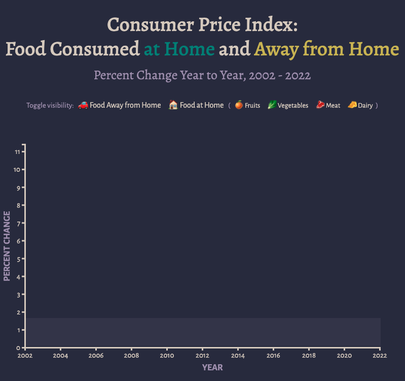

## Homework 4

I can't get this to work!

### What I wanted to do
I tried to add buttons that would display different data. I tried multiple ways, including starting from scratch, editing the week 9 example code, and more, and kept having trouble making anything appear.

### Screenshot of what I did

### What I did accomplish
I did...
- Create buttons (just decorative at this point, but...)
- Expand my data set
- Learn that emoji can go in CSV
- Figure out how to create axis labels, hooray
- Add a shaded area to show the negative percent change

