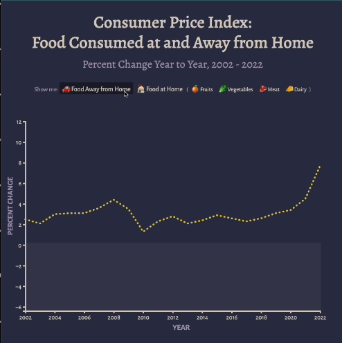

## Homework 4

Thanks again for your help with this! I got it to work pretty quickly after we spoke.

### What this is
I expanded the graph I created in Homework 3 to include more granular data - prices of different types of groceries. I also added the button functionality and the transition, which I think drives home the differences within the data. (And is also satisfying to look at.)
### Screenshot 

### Observations + Questions
- This and Homework 5 are the first visualization I've created that taught me something about the data -- I was surprised how volatile the prices for fruits and vegetables were compared to the averages. I expected the relationships between them to be visually clearer.
- I'm also very curious about what the 2023 data will say - you can see the spike in 2021-2022, and I expect that that's only increased.
- Getting the CSV into the form I wanted it to took a while, since the sheet I originally got my data from (https://www.ers.usda.gov/data-products/food-price-outlook.aspx) had a structure that didn't match an easy conversion to CSV. I think I probably need to dig into some things on Excel next time I encounter a source like this.
- If I were making this again, I'd like to experiment with a way to have multiple lines show up at once. Instead of drawing the line with a function, I suppose I could give each line an ID and use javascript to hide that element? I might make a visualization like that part of my final project. It would be fun to use SVG blend modes with overlapping lines.

